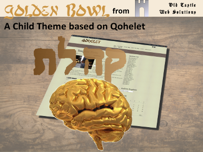

# Golden Bowl
Golden Bowl is a Child Theme based on the responsive theme Qohelet.

## Dependencies
In order to operate Golden Bowl, there are two required dependencies.

1. As a child theme of Qohelet, you must install the theme Qohelet.
2. The slider in the theme will only work if you install the plugin OCWS-Slider.

Both of these dependencies are available from Old Castle Web Solutions, and are fully updateable from GitHub, if you have the GitHub Updater installed.

## Version 0.3
A number of alterations made, to fix the working with the parent theme.

## Version 0.2.1
Corrections to the Options Page